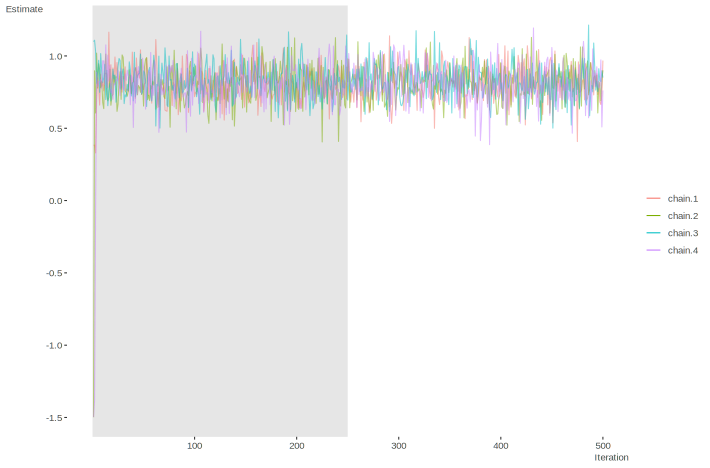

# Regression Models

Now armed with a conceptual understanding of the Bayesian approach, we will actually investigate a regression model using it.  To keep things simple, we start with a standard linear model for regression.  Later, we will show how easy it can be to add changes to the sampling distribution or priors for alternative modeling techniques. But before getting too far, you should peruse the [Modeling Languages][Modeling Languages] section of the appendix to get a sense of some of the programming approaches available.  We will be using the programming language Stan via R and the associated R package <span class="pack">rstan</span>.  If you prefer to keep things conceptual rather than worry about the code, you can read through the following data description and then skip to [running the model][Running the Model].


## Example: Linear Regression Model

In the following we will have some initial data set up and also run the model using the standard <span class="func">lm</span> function for later comparison.  I choose simulated data so that not only should you know what to expect from the model, it can easily be modified to enable further understanding.  I will also use some matrix operations, and if these techniques are unfamiliar to the reader, you'll perhaps want to do some refreshing or learning on your own beforehand.


## Setup

First we need to create the data we'll use here and for most of the other examples in this document.

```{r rstanDataSetup, echo=-c(1:4)}
##########################
### Initial Data Setup ###
##########################

# set seed for replicability
set.seed(8675309)

# create a N x k matrix of covariates
N = 250
K = 3

covariates = replicate(K, rnorm(n=N))
colnames(covariates) = c('X1', 'X2', 'X3')

# create the model matrix with intercept
X = cbind(Intercept=1, covariates)

# create a normally distributed variable that is a function of the covariates
coefs = c(5,.2,-1.5,.9)
mu = X %*% coefs
sigma = 2
y <- rnorm(N, mu, sigma)

# same as
# y = 5 + .2*X1 - 1.5*X2 + .9*X3 + rnorm(N, mean=0, sd=2)

# Run lm for later comparison; but go ahead and examine now if desired
modlm = lm(y~., data=data.frame(X[,-1]))
# summary(modlm)
```

Just to make sure we're on the same page, at this point we have three covariates, and a $y$ that is a normally distributed, linear function of them with standard deviation equal to `r sigma`.  The population values for the coefficients including the intercept are `r paste0(coefs[1:3], ', ', collapse='')` and `r coefs[4]`, though with the noise added, the actual estimated values for the sample are slightly different.  Now we are ready to set up an R list object of the data for input into Stan, as well as the corresponding Stan code to model this data.  I will show all the Stan code, which is implemented in R via a single character string, and then provide some detail on each corresponding model block.  However, the goal here isn't to provide a tutorial on Stan, as you might prefer BUGS or JAGS, and related code for this same model in those languages is provided in the appendix, e.g. [here][Bugs Example]. I don't think there is an easy way to learn these programming languages except by diving in and doing them yourself with models and data you understand.  Furthermore, the focus here is on concepts over tools.

The data list for Stan should include any matrix, vector, or value that might be used in the Stan code.  For example, along with the data one can include things like sample size, group indicators (e.g. for mixed models) and so forth.  Here we can get by with just the N, the number of columns in the model matrix, the target variable and the model matrix itself.

```{r rstanDataList}
# Create the data list object for stan inupt
dat = list(N=N, K=ncol(X), y=y, X=X)
```

Next comes the Stan code.  In <span class="pack">R2OpenBugs</span> or <span class="pack">rjags</span> one would call a separate text file with the code, and one can do the same with <span class="pack">rstan</span>[^stringvsfile], but for our purposes, we'll display it within the R code. The first thing to note then is the model code.  Next, Stan has programming blocks that have to be called in order. I will have all of the blocks in the code to note their order and discuss each in turn, even though we won't use them all.  Anything following a // or #, or between /\* \*/, are comments pertaining to the code.  Assignments in Stan are `=`[^assignment], while distributions are specified with a $\sim$, e.g. `y ~ normal(0, 1)`.

The primary goal here again is to get to the results and beyond, but one should examine the [Stan manual](http://mc-stan.org/documentation/) for details about the code.  In addition, to install <span class="pack">rstan</span> one will need to do so via CRAN or Github ([quickstart guide](https://github.com/Stan-dev/rstan/wiki/RStan-Getting-Started)).  It does not require a separate installation of Stan itself, but it does take a couple steps and does require a C++ compiler[^compiler]. Once you have <span class="pack">rstan</span> installed it is called like any other R package as will see shortly.


```{r rstanStanSetup}
# Create the stan model object using Stan's syntax
stanmodelcode = "
data {                      // Data block
  int<lower=1> N;           // Sample size
  int<lower=1> K;           // Dimension of model matrix
  matrix[N, K] X;           // Model Matrix
  vector[N] y;              // Target variable
}

/* 
transformed data {          // Transformed data block. Not used presently.
} 
*/

parameters {                // Parameters block
  vector[K] beta;           // Coefficient vector
  real<lower=0> sigma;      // Error scale
}

model {                     // Model block
  vector[N] mu;
  mu <- X * beta;           // Creation of linear predictor
  
  // priors
  beta ~ normal(0, 10);
  sigma ~ cauchy(0, 5);     // With sigma bounded at 0, this is half-cauchy
  
  // likelihood
  y ~ normal(mu, sigma);
}

/*
generated quantities {      // Generated quantities block. Not used presently.
}
*/
"
```


### Stan Code

The first section is the <span class="emph">data</span> block, where we tell Stan the data it should be expecting from the data list.  It is useful to put in bounds as a check on the data input, and that is what is being done between the < > (e.g. we should at least have a sample size of 1).  The first two variables declared are N and K, both as integers.  Next the code declares the model matrix and target vector respectively. As you'll note here and for the next blocks, we declare the type and dimensions of the variable and then its name. In Stan, everything declared in one block is available to subsequent blocks, but those declared in a block may not be used in earlier blocks. Even within a block, anything declared, such as N and K, can then be used subsequently, as we did to specify dimensions.

For a reference, the following is from the Stan manual, variables of interest and the associated blocks where they would be declared: 

```{r stanBlocks, results='asis', echo=FALSE}
tab = data.frame(c('modeled, unmodeled data', 'modeled parameters, missing data', 'unmodeled parameters', 'generated quantities', 'loop indices'),
                 c('data, transformed data', 'parameters, transformed parameters', 'data, transformed data', 'transformed data, transformed parameters, generated quantities','loop statement'))
colnames(tab) = c('Variable Kind', 'Declaration Block')
htmlTable::htmlTable(tab, rnames=F)
```

The <span class="emph">transformed data</span> block is where you could do such things as log or center variables and similar, i.e. you can create new data based on the input data or just in general.  If you are using R though, it would almost always be easier to do those things in R first and just include them in the data list.  You can also declare any unmodeled parameters here.

The primary parameters of interest that are to be estimated go in the <span class="emph">parameters </span> block.  As with the data block you can only declare these variables, you cannot make any assignments.  Here we note the $\beta$ and $\sigma$ to be estimated, with a lower bound of zero on the latter. In practice you might prefer to split out the intercept or other coefficients to be modeled separately if they are on notably different scales.

The <span class="emph">transformed parameters</span> block is where optional parameters of interest might be included.  What might go here is fairly open, but for efficiency's sake you will typically want to put things only of specific interest that are dependent on the parameters block.  These are evaluated along with the parameters, so if not of special interest you can generate them in the model or generated quantities block to save time.

The <span class="emph">model</span> block is where your priors and likelihood are specified, along with the declaration of any variables necessary.  As an example, the linear predictor is included here, as it will go towards the likelihood[^modelblock].  Note that we could have instead put the linear predictor in the transformed parameters section, but this would slow down the process, and again, we're not so interested in those specific values. 

I use a normal prior for the coefficients with a zero mean and a very large standard deviation to reflect my notable ignorance here[^regularize].  For the $\sigma$ estimate I use a Cauchy distribution[^cauchy].  Many regression examples using BUGS will use an inverse gamma prior, which is perfectly okay for this model, though it would not work so well for other variance parameters.  Had we not specified anything for the prior distribution for the parameters, vague (discussed more in the [Choice of Prior section][Choice of Prior]), uniform distributions would be the default. The likelihood is specified in pretty much the same manner as we did with R. BUGS style languages would actually use dnorm as in R, though Stan uses 'normal' for the function name.

Finally, we get to the <span class="emph">generated quantities</span>, which is kind of a fun zone. *Anything* you want to calculate can go here- predictions on new data, ratios of parameters, how many times a parameter is greater than x, transformations of parameters for reporting purposes, and so forth.  We will demonstrate this later.


### Running the Model

Now that we have an idea of what the code is doing, let's put it to work.  Bayesian estimation, like maximum likelihood, starts with initial guesses as starting points and then runs in an iterative fashion, producing simulated draws from the posterior distribution at each step, and then correcting those draws until finally getting to some target, or *stationary* distribution. This part is key and different from classical statistics.  We are aiming for a distribution, not a point estimate.

The simulation process is referred to as <span class="emph">Markov Chain Monte Carlo</span>, or MCMC for short.  The specifics of this process are what sets many of the Bayesian programming languages/approaches apart, and something we will cover in more detail in a later section (see [Sampling Procedure][Sampling Procedure]).  In MCMC, all of the simulated draws from the posterior are based on and correlated with the previous[^mcmccor], as the process moves along the path toward a stationary distribution.  Typically we will allow the process to *warm up*, or rather get a bit settled down from the initial starting point, which might be way off, and thus the subsequent estimates will also be way off for the first few iterations. <span class="marginnote">How far one wants to go down the rabbit hole regarding MCMC is up to the reader.  A great many applied researchers do classical statistical analysis without putting much thought into the actual maximum likelihood estimation process, and I suppose one could do so here as well.</span> Rest assured, assuming the model and data are otherwise acceptable, the process will get to where it needs to go.  However, as a further check, we will run the whole thing multiple times, i.e. have more than one *chain*.  As the chains will start from different places (sometimes only very slightly so), if multiple chains get to the same place in the end, we can feel more confident about our results.


While this process may sound like it might take a long time to complete, for the following you'll note that it will likely take more time for Stan to compile its code to C++ than it will to run the model[^speed], and on my computer each chain only takes a little less than three seconds.  However it used to take a very long time even for a standard regression such as this, and that is perhaps the primary reason why Bayesian analysis only caught on in the last couple decades; we simply didn't have the machines to do it efficiently.  Even now though, for highly complex models and large data sets it can still take a long time to run, though typically not prohibitively so.

In the following code, we note the object that contains the Stan model code, the data list, how many iterations we want (12000)[^toomanyiter], how long we want the process to run before we start to keep any estimates (warmup=2000), how many of the post-warmup draws of the posterior we want to keep (thin=10 means every tenth draw), and the number of chains (3).  In the end we will have three chains of 1000<span class="marginnote">$\frac{12000-2000}{10} = 1000$</span> draws from the posterior distribution of the parameters.  Stan spits out a lot of output to the R console even with `verbose = FALSE`, and I omit it here, but you will see some initial info about the compiling process, updates as each chain gets through 10% of iterations specified in the `iter` argument, and finally an estimate of the elapsed time.  You may also see *informational messages* which, unless they are highly repetitive, should not be taken as an error.


```{r rstanRunModel, results='hide', echo=1:4, eval=F}
library(rstan)

### Run the model and examine results ###
fit = stan(model_code=stanmodelcode, data=dat, iter=12000, 
           warmup=2000, thin=10, chains=3)
```

```{r, echo=F, eval=F}
save(fit, modlm, X, y, file='miscObjects/mainModels.RData')# for use in standalone chaps
```


With the model run, we can now examine the results.  In the following, we specify the digit precision to display, which parameters we want (not necessary here), and which quantiles of the posterior draws we want, which in this case are the median and those that would produce a 95% interval estimate. 

```{r rstanModelSummary, echo=-1}
load('data/mainModels.RData')
# summary
print(fit, pars=c('beta', 'sigma'), digits=3, prob=c(.025,.5,.975))
```

So far so good.  The mean estimates reflect the mean of posterior draws for the parameters of interest, and are the typical coefficients reported in standard regression analysis.  The 95% probability, or, <span class="emph">credible intervals</span> are worth noting, because *they are not confidence intervals as you know them*.  There is no repeated sampling interpretation here[^confint].  The probability interval is more intuitive. It means simply that, based on the results of this model, there is a 95% chance the true value will fall between those two points.  The other values printed out I will return to in just a moment.

Comparing the results to those from R's <span class="func">lm</span> function, we can see we obtain similar estimates.
Had we used uniform priors[^justlikelm], we would doing essentially the same as what is being done in standard maximum likelihood estimation.  Here, we have a decent amount of data for a model that isn't complex, so we would expect the likelihood to notably outweigh the prior, as we demonstrated previously with our binomial example.

```{r rstanCompareStanlm}
summary(modlm)
```

But how would we know if our model was working out okay otherwise?  There are several standard diagnostics, and we will talk in more detail about them in the next section, but let's take a look at some presently.  In the summary, `se_mean` is the <span class="emph">Monte Carlo error</span>, and is an estimate of the uncertainty contributed by only having a finite number of posterior draws. `n_eff` is <span class="emph">effective sample size</span> given all chains and essentially accounts for autocorrelation in the chain, i.e. the correlation of the estimates as we go from one draw to the next. It actually doesn't have to be very large, but if it was small relative to the total number of draws desired that might be cause for concern.  `Rhat` is a measure of how well chains mix, and goes to 1 as chains are allowed to run for an infinite number of draws.  In this case, `n_eff` and `Rhat` suggest we have good convergence, but we can also examine this visually with a traceplot.


```{r rstanModelDiagnostics, eval=F, fig.align='center'}
# Visualize
stan_trace(fit, pars=c('beta[4]'))
```

<span class="imgbigger"></span>

```{r rstanModelDiagnostics2, echo=F, eval=FALSE}
# library(rstan)
# stan_trace(fit, pars=c('beta[4]'), inc_warmup=F) + 
#   labs(y='x3 Coefficient Estimate', x='Iteration') + 
#   theme_minimal() + 
#   theme(panel.grid=element_blank(),
#         plot.background=element_rect(fill='transparent', color=NA))   # as of 5-2016, rstan's traceplot isn't working properly, and is ugly anyway
beta4 = extract(fit, pars=c('beta[4]'), inc_warmup=T, permute=F)[,,1]
beta4 = tidyr::gather(data.frame(beta4), key=chain, value=estimate) %>% mutate(Iteration=rep(1:1200, t=3))
ggplot(data=beta4) +
  annotate("rect", xmin = 0, xmax = 200, ymin = -Inf, ymax = Inf, fill = 'black', alpha=.1) +
  geom_path(aes(x=Iteration, y=estimate, color=chain), alpha=.5)  +
  guides(colour = guide_legend(override.aes = list(alpha = 1))) +
  scale_x_continuous(limits=c(0,1200), breaks=c(200,500,750,1000,1200)) +
  labs(x='Iteration', y='Estimate') +
  lazerhawk::theme_trueMinimal() +
  theme(plot.background=element_rect(fill='transparent', color=NA),
        legend.background=element_rect(fill='transparent', color=NA),
        legend.title=element_blank())
ggsave('img/traceplotWarmup.svg', bg='transparent')

# pdf('img/traceplotNoWarmup.pdf')
# traceplot(fit, pars=c('beta','sigma'), inc_warmup=F)
# dev.off()
# plot(fit, pars=c('beta','sigma')) # ugh
# pairs(fit, pars=c('beta','sigma'))
```

I only show one parameter for the current demonstration, but one should always look at the traceplots for all parameters.  What we are looking for after the warmup period is a "fat hairy caterpillar" or something that might be labeled as "grassy", and this plot  qualifies as such[^diagnostics]. One can see that the estimates from each chain find their way from the starting point to a more or less steady state quite rapidly (warmup perior in gray).  Furthermore, all three chains, each noted by a different color, are mixing well and bouncing around the same conclusion. The statistical measures and traceplot suggest that we are doing okay.

There are other diagnostics available in the <span class="pack">coda</span> package, and Stan model results can be easily converted to work with it.  The following code demonstrates how to get started.

```{r rstanToCoda, eval=FALSE, echo=1:4}
library(coda)
betas = extract(fit, pars='beta')$beta
betas.mcmc = as.mcmc(betas)
plot(betas.mcmc)

pdf('img/codaPlot.pdf')
betas.mcmc = as.mcmc(extract(fit, pars='beta', permuted=F)[,1,])
plot(betas.mcmc, col='gray50', bty='n', main='', xlab='')
dev.off()
apply(betas.mcmc, 2, function(x) ks.test(x, rnorm(1000, mean(x), sd(x))))
apply(betas.mcmc, 2, shapiro.test)
```

So there you have it.  Aside from the initial setup with making a data list and producing the language-specific model code, it doesn't necessarily take much to running a Bayesian regression model relative to standard models[^otherpacks].  The main thing perhaps is simply employing a different mindset, and interpreting the results from within that new perspective.  For the standard models you are familiar with, it probably won't take too long to be as comfortable here as you were with those, and now you will have a flexible tool to take you into new realms with deeper understanding.


[^assignment]: `<-` is now deprecated, but you may see older examples using it.

[^bugs2stan]: In general their modeling syntax is not too difficult to translate from Stan and often very similar.

[^stringvsfile]: In your own Stan pursuits it's better to have the Stan model as a separate file.

[^compiler]: You can examine this [list](https://en.wikipedia.org/wiki/List_of_compilers\#C.2B.2B_compilers) for possibilities, or simply install Rtools from the R website (recommended). Note that you may already have one incidentally.  Try the Stan test in their getting started guide before downloading one.

[^modelblock]: The position within the model block isn't crucial. I tend to like to do all the variable declarations at the start, but others might prefer to have them under the likelihood heading at the point they are actually used.

[^regularize]: By setting the prior mean to zero, this will have the effect of shrinking the coefficients toward zero to some extent.  In this sense, it is equivalent to penalized regression in the non-Bayesian setting, ridge regression in particular.

[^cauchy]: Actually a half-Cauchy as it is bounded to be positive. This is equivalent to a student t with df=1, and there is some tendency of late to use the student t directly with df=3 for slight gains in performance for some models.

[^mcmccor]: In a Markov Chain, $\theta_t$ is independent of previous $\theta_{t-2...t_1}$, conditional on $\theta_{t-1}$.

[^speed]: Not usually the case except for simple models with smaller data.

[^toomanyiter]: This is way overkill for a simple model like this.  One probably would be fine with 500 warmup and 500 iterations.

[^confint]: A standard confidence implies that if we'd done the study exactly the same over and over, and calculated a confidence interval each time, 95% of them would capture the true value. The one you have is just one from that process.

[^justlikelm]: In Stan code this can be done by not explicitly specifying a prior.

[^diagnostics]: Like all model diagnostics, we aren't dealing with an exact science.

[^otherpacks]: Other R packages would allow for regression models to be specified just like you would with the <span class="func">lm</span> and <span class="func">glm</span> functions.  See the <span class="pack">rstanarm</span> (from the developers of Stan) and <span class="pack">brms</span> especially.