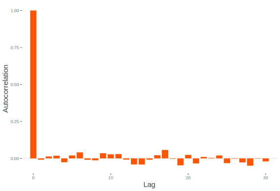
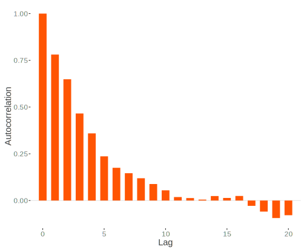

# Model Exploration

As with modeling in traditional  approaches, it is not enough to simply run a model and go with whatever results are returned without further inspection.  One must examine the results to assess model integrity and have more confidence in the results that have been produced[^noinspection].


## Monitoring Convergence

There are various ways to assess whether or not the model has converged to a target distribution[^targetdist], but as with more complex models in MLE, there is nothing that can tell you for sure that you've hit upon *the* solution.  As a starting point, Stan or other modeling environments will spit out repeated warnings or errors if something is egregiously wrong, or perhaps take an extraordinarily long time to complete relative to expectations, if it ever finishes at all.  Assuming you've at least gotten past that point, there is more to be done.

### Visual Inspection: Traceplot & Densities

In the previous model we noted the traceplot for a single parameter, and a visual approach to monitoring convergence is certainly one good method.  In general, we look for a plot that shows random scatter around a mean value, and our model results suggest that the chains mixed well and the traceplot looked satisfactory.


This is an example where things have gone horribly wrong.  The chains never converge nor do they mix with one another.  One reason for running multiple chains is that any individual chain might converge toward one target, while another chain might converge elsewhere, and this would still be a problem.  Also, you might see otherwise healthy chains get stuck on occasion over the course of the series, which might suggest more model tweaking or a change in the sampler settings is warranted.

We can examine the mixed chains and density plots of the posterior with standard functions in the <span class="pack">rstan</span> package displayed previously, various functions in the <span class="pack">bayesplot</span> package, or interactively via <span class="pack">shinyStan</span> package and its <span class="func">launch_shiny</span> function.  In the Bayesian approach, increasing amounts of data leads to a posterior distribution of the parameter vector approaching multivariate normality.  The following shows a density, trace and autocorrelation plots for one of the regression coefficients using <span class="pack">shinyStan</span>.

<br>


```{r badChain, eval=FALSE, echo=FALSE}
# see https://groups.google.com/forum/#!topic/stan-users/hio0siMTvhE
# unidentified model
mc_bad2 <- '
data{
    int N;
    real y[N];
}
parameters{
    real a1;
    real a2;
    real<lower=0> sigma;
}
model{
    y ~ normal( a1+a2 , sigma );
}
'

library(rstan)
y <- rnorm(100)
m_bad3 <- stan(model_code=mc_bad2 , data=list(y=y,N=length(y)) )
traceplot(m_bad3, par='a1', yaxt='n')
library(coda)
traceplot(as.mcmc(extract(m_bad3, 'a1', permuted=F)$a1))
showMethods(traceplot, class = "stanfit", include = TRUE) 

library(ggplot2); library(reshape2)
gdat = melt(data.frame(extract(m_bad3, 'a1', permuted=F)[,,1]))
ggplot(aes(x=rep(1:1000, 4), y=value, color=variable, group=variable), data=gdat) +
  geom_line(show.legend=F) + 
  labs(x='', y='') +
  theme_trueMinimal() + 
  theme(axis.text.y=element_blank(),
        axis.ticks.y=element_blank(),
        plot.background=element_rect(fill = "transparent",colour = NA))
# ggsave('img/badchains.pdf', width=11, height=8.5)
ggsave('img/badchains.svg', width=11, height=8.5, bg='transparent')
# ggsave('img/badchains.png', width=11, height=8.5, bg='transparent')
```

### Statistical Measures

To go along with visual inspection, we can examine various statistics that might help our determination of convergence or lack thereof.  Gelman and Rubin's <span class="emph">potential scale reduction factor</span>, $\hat{R}$, provides an estimate of convergence based on the variance of an estimated parameter $\theta$ between chains, and the variance within a chain. It is interpreted as the factor by which the variance in the estimate might be reduced with longer chains.  We are looking for a value near 1 (and at the very least less than 1.1), and it will get there as $N_{sim} \rightarrow \infty$.  In the regression model things are looking good in this respect.

```{r showRhat, echo=FALSE}
broom::tidy(fit, rhat=T)[,c(1:2,4)] %>% format(digits=4) %>% pander(justify='lrr')
```


The <span class="pack">coda</span> package provides other convergence statistics based on Geweke (1992) and Heidelberger and Welch (1983).  Along with those statistics, it also has plots for the $\hat{R}$ and Geweke diagnostics.


### Autocorrelation

As noted previously, each estimate in the MCMC process is serially correlated with the previous estimates by definition.  Furthermore, other aspects of the data, model, and estimation settings may contribute to this.  Higher serial correlation typically has the effect of requiring more samples in order to get to a stationary distribution. If inspection of the traceplots look more *snake-like* than like a fat hairy caterpillar, this might suggest such a situation, and that more samples are required. 

We can also look at the autocorrelation plot, in which the chain's correlation with successive lags of the chain are plotted.  The first plot is the autocorrelation plot from our model (starting at lag 1). The correlation is low to begin with and then just bounces around zero after.  The next plot shows a case of high serial correlation, where the correlation with the first lag is high and the correlation persists even after longer lags.  A longer chain with more thinning could help with this.


<!--  -->
<!--  -->

```{r autocorrExample, echo=FALSE, out.width='500px'}
# first do original acf
library(coda)
betas = rstan::extract(fit, pars='beta', permuted=F)[,1:3,4] #1st chain beta4
betas.mcmc = as.mcmc(betas)
# pdf('img/acfPlotNoSerial.pdf')
# acfplot(betas.mcmc[,1])
# dev.off()
# acf(betas.mcmc[,1], bty='n', col='#ff5500', lwd=3, main='', ci.col=scales::alpha('blue',.5), 
#     xaxt='n', ylab='Autocorrelation', col.lab='gray25', col.axis='gray50')

test0 = acf(betas.mcmc[,1], plot = FALSE)
test = with(test0, data.frame(lag, acf))
ggplot(data = test, mapping = aes(x = lag, y = acf)) +
  geom_hline(aes(yintercept = 0), col='gray90') +
  geom_segment(mapping = aes(xend = lag, yend = 0), col='#ff5500', lwd=1.5) +
  geom_point(mapping = aes(x = lag, y=acf), col=palettes$orange$complementary[2], size=5) +
  labs(x='Lag',  y='Autocorrelation') +
  theme_trueMinimal() +
  theme(axis.title.x=element_text(color='gray25', size=15),
        axis.title.y=element_text(color='gray25', size=15),
        plot.background = element_rect(fill = "transparent",colour = NA))
# ggsave('img/acfPlotNoSerial.svg', bg='transparent')

pres2 = presidents; pres2[1] = 87
for(i in 2:length(pres2)){
  pres2[i] = ifelse(is.na(pres2[i]), pres2[i-1], pres2[i])
}
# pdf('img/acfPlotSerial.pdf')
# acfplot(as.mcmc(pres2))
# dev.off()
test0 = acf(as.mcmc(pres2), plot = FALSE)
test = with(test0, data.frame(lag, acf))
ggplot(data = test, mapping = aes(x = lag, y = acf)) +
  geom_hline(aes(yintercept = 0), col='gray90') +
  geom_segment(mapping = aes(xend = lag, yend = 0), col='#ff5500', lwd=1.5, show.legend=F) +
  geom_point(mapping = aes(x = lag, y=acf), col=palettes$orange$complementary[2], size=5, show.legend=F) +
  labs(x='Lag',  y='Autocorrelation') +
  theme_trueMinimal() +
  theme(axis.title.x=element_text(color='gray25', size=15),
        axis.title.y=element_text(color='gray25', size=15),
        plot.background = element_rect(fill = "transparent",colour = NA))
# ggplotly()
# ggsave('img/acfPlotSerial.svg', bg='transparent')
```


The effective number of simulation draws is provided as $n_{\textrm{eff}}$ in the Stan output, and is similarly obtained in BUGS/JAGS.  Ideally, we would desire this number to equal the number of posterior draws requested, and in the presence of essentially no autocorrelation the values would be equal.  This is not a requirement though, and technically a low number of draws would still be usable.  However, a notable discrepancy might suggest there are some issues with the model, or simply that longer chains could be useful. In our current model, all our effective sample sizes are at or near the total number of posterior draws.

```{r showNeff, echo=FALSE}
broom::tidy(fit, ess=T)[,c(1:2,4)] %>% format(digits=4) %>% pander(justify='lrr')
```

<span class="emph">Monte Carlo error</span> is an estimate of the uncertainty contributed by only having a finite number of posterior draws. We'd typically want roughly less than 5% of the posterior standard deviation (reported right next to it in the Stan output), but might as well go for less than 1%. With no autocorrelation it would equal $\sqrt{\frac{var(\theta)}{n_{\textrm{eff}}}}$[^mcerr]. and $n_{\textrm{eff}}$ would equal the number of simulation draws requested.

```{r showMCerror, echo=FALSE}
rstan::summary(fit, pars=c('beta', 'sigma'))$summary[,c('mean', 'se_mean')] %>% 
  format(digits=1) %>% 
  pander(justify='lrr')
```


## Model Checking

Checking the model for suitability is crucial to the analytical process[^ppcheck].  Assuming initial diagnostic inspection for convergence has proven satisfactory, we must then see if the model makes sense in its own right.  This can be a straightforward process in many respects, and with  Bayesian analysis one has a much richer environment in which to do so compared to traditional methods.

### Sensitivity Analysis

Sensitivity analysis entails checks on our model settings to see if changes in them, perhaps even slight ones, result in changes in posterior inferences.  This may take the form of comparing models with plausible but different priors, different sampling distributions, or differences in other aspects of the model such as the inclusion or exclusion of explanatory variables.  While an exhaustive check is impossible, at least some effort in this area should be made.

### Predictive Accuracy & Model Comparison

A standard way to check for model adequacy is simply to investigate whether the predictions on new data are accurate.  In general, the measure of predictive accuracy will be specific to the data problem, and involve posterior simulation of the sort covered in the next section.  In addition, while oftentimes new data is hard to come by, assuming one has sufficient data to begin with, one could set aside part of it specifically for this purpose. In this manner one trains and tests the model in much the same fashion as machine learning approaches.  In fact, one can incorporate the validation process as an inherent part of the modeling process in the Bayesian context just as you would there.  

For model comparison of out of sample predictive performance, there are information measures similar to the Akaike information criterion (AIC), that one could use in the Bayesian environment.  One not to use is the so-called Bayesian information criterion (or BIC), which is not actually Bayesian nor a measure of predictive accuracy.  BUGS provides the DIC, or deviance information criterion, as part of its summary output, which is a somewhat Bayesian version of the AIC.  More recently developed, the WAIC, or Watanabe-AIC[^waic], is a more fully Bayesian approach.  Under some conditions, the DIC and WAIC measures are asymptotically equivalent to Bayesian leave-one-out cross validation, as the AIC is under the classical setting.

### Posterior Predictive Checking: Statistical

For an overall assessment of model fit, we can examine how well the model can reproduce the data at hand given the $\theta$ draws from the posterior.  We discussed earlier the <span class="emph">posterior predictive distribution</span> for a future observation $\tilde{y}$[^ppcheck2], and here we'll dive in to using it explicitly. There are two sources of uncertainty in our regression model, the variance in $y$ not explained by the model ($\sigma^2$), and posterior uncertainty in the parameters due to having a finite sample size.  As $N\rightarrow\infty$, the latter goes to zero, and so we can simulate draws of $\tilde{y} \sim N(\tilde{X}\beta, \sigma^2I)$[^conjugate]. If $\tilde{X}$ is the model data as in the following, then we will refer to $y^{\textrm{Rep}}$ instead of $\tilde{y}$.

For our model, this entails extracting the simulated values from the model object, and taking a random draw from the normal distribution based on the $\beta$ and $\sigma$ that are drawn to produce our <span class="emph">replicated data</span>, $y^{\textrm{Rep}}$ (see @gelman_bda, Appendix C).  In what follows, I write out the process explicitly, but <span class="pack">bayesplot</span>, <span class="pack">rstanarm</span>, and <span class="pack">brms</span> make this straightforward, possibly with a single line of code, the latter packages using <span class="pack">bayesplot</span>. In addition, it's often simpler to create the $y^{\textrm{Rep}}$ as part of your generated quantities section of the model code if modeling with Stan explicitly.

```{r posteriorPredictiveExample, fig.show='hide', echo=-(1:3)}
load('data/mainModels.RData')
library(rstan)

# extract the simulated draws from the posterior and note the number for nsims
theta = extract(fit)
betas = theta$beta
sigmas = theta$sigma
nsims = length(theta$sigma)

# produce the replications and inspect
yRep = sapply(1:nsims, function(s) rnorm(250, X%*%betas[s,], sigmas[s]))
str(yRep)
```

With the $y^{\textrm{Rep}}$ in hand we can calculate all manner of statistics that might be of interest[^yrep]. 

As a starting point, we can check our minimum value among the replicated data sets versus that observed in the data.

```{r posteriorPredictiveMinComparison, fig.keep='none', fig.show='hide'}
min_rep = apply(yRep, 2, min)
min_y = min(y)
hist(min_rep, main=''); abline(v=min_y)
c(mean(min_rep), min_y)
prop.table(table(min_rep>min_y))
sort(y)[1:5]
```

```{r posteriorPredictiveMinComparisonHist, echo=FALSE, out.width='500px'}
prop.table(table(min_rep>sort(y)[3]))
# pdf('img/histofyrepMinimum.pdf', paper='USr')
# hist(min_rep, main='', 'FD', yaxt='n', ylab='', border='gray50'); abline(v=min_y, col='gray50')
# dev.off()
ggplot(aes(x=min_rep), data=data_frame(min_rep=min_rep)) + 
  geom_density(fill=scales::alpha('#ff5500', .5), color='transparent') + 
  geom_line(color=palettes$orange$complementary[2], stat='density') + 
  geom_vline(xintercept=min_y, color='gray50', alpha=.75) + 
  theme_trueMinimal() +
  theme(axis.title.x=element_text(color='gray25', size=15),
        axis.title.y=element_text(color='gray25', size=15),
        plot.background = element_rect(fill = "transparent",colour = NA))
# ggsave('img/histofyrepMinimum.svg', bg='transparent')
```


These results suggest we may be having difficulty picking up the lower tail of the target variable, as our average minimum is notably higher than that seen in the data, and almost all our minimums are greater than the observed minimum ($p=.99$).  While in this case where we are dealing with a simulated data set and we know that assuming the normal distribution for our sampling distribution is appropriate, this might otherwise have given us pause for further consideration.  A possible solution would be to assume a $t$ distribution for the likelihood, which would have fatter tails and thus possibly be better able to handle extreme values. We'll show an example of this later.  In this case it is just that by chance one of the $y$ values, `r round(min(y), 3)`, is fairly extreme relative to the others. Also, it is typically difficult to capture extreme values in practice. As a comparison, the model actually captures the 5^th^, 10^th^ (shown), and 25^th^ quantile values very well. 

```{r posteriorPredictive10thComparisonHist, echo=FALSE, out.width='500px'}
q10 = function(y) quantile(y, 0.1)
q10_rep = bayesplot::ppc_stat(y, t(yRep), stat=q10)$data

ggplot(aes(x=value), data=q10_rep) + 
  geom_density(fill=scales::alpha('#ff5500', .5), color='transparent') + 
  geom_line(color=palettes$orange$complementary[2], stat='density') + 
  geom_vline(xintercept=quantile(y, .1), color='gray50', alpha=.75) + 
  theme_trueMinimal() +
  theme(axis.title.x=element_text(color='gray25', size=15),
        axis.title.y=element_text(color='gray25', size=15),
        plot.background = element_rect(fill = "transparent",colour = NA))
# ggsave('img/histofyrepQ10.svg', bg='transparent')
```

<p style="font-size:.75em; text-align:center">See <span class="func">ppc_stat</span> in <span class="pack">bayesplot</span>.</p>

In general, we can devise a test statistic, $T_{\textrm{Rep}}$, and associated p-value to check *any* particular result of interest based on the simulated data.  The p-value in this context is simply the percentage of times the statistic of interest is equal to or more extreme than the statistic, $T_y$, calculated for the original data.  Thus p-values near 0 or 1 are indicative of areas where the model is falling short in some fashion. Sometimes $T_y$ may be based on the $\theta$ parameters being estimated, and thus you'd have a $T_y$ for every posterior draw. In such a case, one might examine the scatterplot of $T_{\textrm{Rep}}$ vs. $T_y$, or examine a density plot of the difference between the two.  In short, this is an area where one can get creative, and the <span class="pack">bayesplot</span> package can help with make this fairly easy.  However, it must be stressed that we are not trying to accept or reject a model hypothesis as in the frequentist setting- we're not going to throw a model out because of an extreme p-value in our posterior predictive check.  We are merely trying to understand the model's shortcomings as best we can, and make appropriate adjustments if applicable.  It is often the case that the model will still be good enough for practical purposes.


### Posterior Predictive Checking: Graphical

As there are any number of ways to do statistical posterior predictive checks, we have many options for graphical inspection as well.  I show a graph of our average fitted values versus the observed data as a starting point.  The average is over all posterior draws of $\theta$.

```{r posteriorPredictiveFitted, echo=FALSE, out.width='500px'}
fits = sapply(1:nsims, function(s) X%*%betas[s,])
avgfits = rowMeans(fits)
ggplot(aes(x=y, y=avgfits), data=data.frame(y=y, avgfits=avgfits)) +
  # geom_point(col=palettes$orange$complementary, alpha=.75, size=3) +
  geom_point(col='#ff5500', alpha=.75, size=3) +
  labs(x='Observed y', y='Expected y') +
  theme_trueMinimal() +
  theme(axis.title.x=element_text(color='gray25'),
        axis.title.y=element_text(color='gray25'),
        plot.background = element_rect(fill = "transparent",colour = NA))
# ggsave('img/posteriorPredictiveFittedvsObserved.svg', bg='transparent')
```
<p style="font-size:.75em; text-align:center">See <span class="func">ppc_scatter_avg</span> in <span class="pack">bayesplot</span>.</p>


Next, I show density plots for a random sample of 20 of the replicated data sets along with that of the original data (shaded).  It looks like we're doing pretty well here. The subsequent figure displays the density plot for individual predictions for a single value of $y$ from our data. In general, the model captures this particular observation of the data decently.


```{r posteriorPredictiveIndividually, echo=FALSE, out.width='500px'}
yRepSample = yRep[,sample(1:nsims, 20)]
# gdat = melt(yRepSample); colnames(gdat) = c('n', 'nsim', 'yRep')
gdat = data.frame(yRepSample) %>% 
  rename_all(stringr::str_replace, pattern='X', replacement='Sim ') %>% 
  gather(key=nsim, value=yRep) %>% 
  group_by(nsim) %>% 
  mutate(N=1:n()) %>% 
  ungroup()
ggplot(aes(x=yRep), data=gdat) +
  stat_density(aes(x=y), size=1, fill='gray90', data.frame(y=y)) +
  stat_density(aes(group=as.factor(nsim), color=as.factor(nsim)), 
               alpha=.25, show.legend=F, geom='line', position='dodge') +  
  # scale_color_discrete()
  labs(x='', y='') +
  theme_trueMinimal() +
  theme(axis.text.y=element_blank(),
        axis.ticks.y=element_blank(),
        plot.background = element_rect(fill = "transparent",colour = NA))
# ggsave('img/yRepDensity.svg', bg='transparent')


# marginal distribution check for each y as in BDA 6.5
# ggplot(aes(x=yRep), data=gdat) +
# #   stat_density(aes(x=y), size=1, fill='gray90') +
#   stat_density(aes(group=as.factor(N), color=as.factor(N)), 
#                alpha=.5, show.legend=F, geom='line', position='dodge') +  
#   geom_vline(aes(xintercept=quantile(y)[3])) +
#   labs(x='', y='') +
#   theme_trueMinimal() +
#   theme(axis.text.y=element_blank(),
#         axis.ticks.y=element_blank())

# yq = round(seq(1,250, length=5)) # rough quantiles
# yq = c(50,125,200)
yRepSample = yRep[,sample(1:nsims, 200)]
yq = 100
gdat = data.frame(yRepSample) %>% 
  rename_all(stringr::str_replace, pattern='X', replacement='Sim ') %>% 
  gather(key=nsim, value=yRep) %>% 
  group_by(nsim) %>% 
  mutate(N=1:n()) %>% 
  ungroup() %>%
  filter(N %in% yq)
ggplot(aes(x=yRep), data=gdat) +
  geom_vline(aes(xintercept=sort(y)[yq]), alpha=.5) +
  stat_density(aes(group=as.factor(N)), color='#ff5500', 
               alpha=.85, show.legend=F, geom='line', position='dodge') +  
  labs(x='', y='') +
  theme_trueMinimal() +
  theme(axis.text.y=element_blank(),
        axis.ticks.y=element_blank(),
        plot.background = element_rect(fill = "transparent",colour = NA))

# ggsave('img/posteriorPredictiveFittedY.svg', bg='transparent')
```

<p style="font-size:.75em; text-align:center">See <span class="func">ppc_dens_overlay</span> in <span class="pack">bayesplot</span>.</p>

We can also examine residual plots of $y - E(y|X,\theta)$ as with standard analysis, shown as the final two figures for this section.  The first shows such *realized* residuals, so-called as they are based on a posterior draw of $\theta$ rather than point estimation of the parameters, versus the expected values from the model.  The next plot shows the average residual against the average fitted value.  No discernible patterns are present, so we may conclude that the model is adequate in this regard[^dupeplot].


```{r posteriorPredictiveResiduals, echo=FALSE, out.width='500px'}
# marginal distribution check for each y as in BDA 6.5
# library(ggplot2); library(reshape2)
fits = sapply(1:nsims, function(s) X%*%betas[s,])
realizedResids = sapply(1:nsims, function(s) rnorm(250, fits[,s], sigmas[s]) - fits[,s])
# gdat = melt(realizedResids); colnames(gdat) = c('n', 'nsim', 'residual')
gdat = data.frame(realizedResids) %>% 
  rename_all(stringr::str_replace, pattern='X', replacement='Sim ') %>% 
  gather(key=nsim, value=residual) %>% 
  group_by(nsim) %>% 
  mutate(N=1:n()) %>% 
  ungroup()
gdat$fit = gather(data.frame(fits))[,'value']
gdat$minres = rep(apply(realizedResids, 1, min), 1000)
gdat$maxres = rep(apply(realizedResids, 1, max), 1000)

# plot 6.11a
ggplot(aes(x=fit, y=residual), data=gdat[1:250,]) +
#   geom_linerange(aes(ymin=minres, ymax=maxres), alpha=.1) + 
  geom_hline(aes(yintercept=0), col='darkred', alpha=.25) +
  geom_point(aes(ymin=minres, ymax=maxres), color='#FF5500', alpha=.85) + 
  scale_x_continuous(breaks=c(-3,0,3,6,9,12)) +
  labs(x='Expected y', y='Realized Residual') +
  theme_trueMinimal() +
  theme(axis.title.x=element_text(size=15),
        axis.title.y=element_text(size=15),
        axis.text.y=element_blank(),
        axis.ticks.y=element_blank(),
        plot.background = element_rect(fill = "transparent",colour = NA))

# ggsave('img/posteriorPredictiveResidualRaw.svg', bg="transparent")


avgfits = rowMeans(fits)
residRep = sweep(yRep, 1, avgfits)
avgresidRep = rowMeans(yRep-fits)

# figure 6.11b
ggplot(aes(x=avgfits, y=avgresidRep), data=data.frame(avgfits, avgresidRep)) +
  geom_point(alpha=.85, color='#FF5500') +
  labs(x='Average Expected y', y='Average Realized Residual') +
  theme_trueMinimal() +
  theme(axis.title.x=element_text(size=15),
        axis.title.y=element_text(size=15),
        axis.text.y=element_blank(),
        axis.ticks.y=element_blank(),
        plot.background = element_rect(fill = "transparent",colour = NA))

# ggsave('img/posteriorPredictiveResidualAvg.svg', bg="transparent")
```


## Summary

As with standard approaches, every model should be checked to see whether it holds up under scrutiny. The previous discussion suggests only a few ways one might go about checking whether the model is worthwhile, but this is a very flexible area where one can answer questions beyond model adequacy and well beyond what traditional models can tell us. Not only is this phase of analysis a necessity, one can use it to explore a vast array of potential questions the data presents, and maybe even answer a few.


[^noinspection]: I wonder how many results have been published on models that didn't converge with the standard MLE.  People will often ignore warnings as long as they get some sort of result.

[^targetdist]: Recall again that we are looking for convergence to a distribution, not a point estimate of a specific parameter.

[^mcerr]: This is the 'naive' estimate the <span class="pack">coda</span> package provides in its summary output.

[^ppcheck]: Gelman devotes an entire chapter to this topic to go along with examples of model checking throughout his text.  Much of this section follows that outline.

[^ppcheck2]: $p(\tilde{y}|y) = \int p(\tilde{y}|\theta)p(\theta|y)\mathrm{d}\theta$

[^waic]: See [Gelman et al. (2013)](http://www.stat.columbia.edu/~gelman/research/published/waic_understand3.pdf) for a review and references. See [Vehtari & Gelman (2014)](http://www.stat.columbia.edu/~gelman/research/unpublished/waic_stan.pdf) for some more on WAIC, as well as the R package <span class="pack">loo</span>.

[^conjugate]: Technically, in the conjugate case the posterior predictive is t-distributed because of the uncertainty in the parameters, though it doesn't take much sample size for simple models to get to approximately normal. Conceptually, with $\hat{\beta}$ being our mean $\beta$ estimate from the posterior, this can be represented as: <br> $\tilde{y} \sim t(\tilde{X}\hat{\beta}, \sigma^2 + \textrm{parUnc}, \textrm{df}=N-k)$

[^yrep]: In many cases you might want to produce this in the generated quantities section of your Stan code, but doing so outside of it will keep the <span class="objclass">stanfit</span> object smaller, which may be desirable.

[^dupeplot]: The two plots directly above replicate the figures in 6.11 in Gelman 2013.