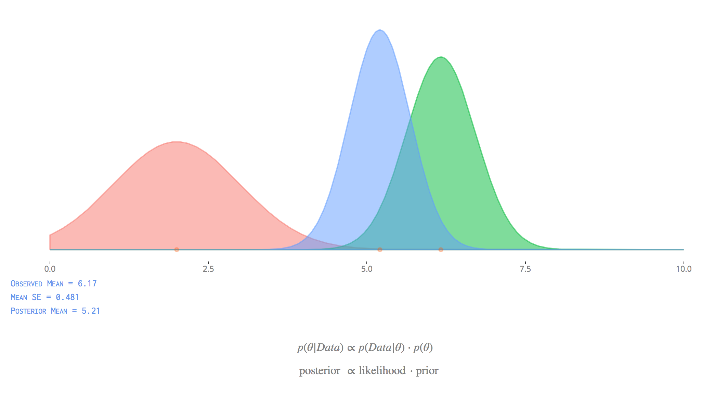

# Bayesian Basics

This is a document that introduces Bayesian data analysis. It serves as a practical and applied introduction to Bayesian approaches for the uninitiated. The goal is to provide just enough information in a brief format to allow one to feel comfortable exploring Bayesian data analysis for themselves, assuming they have the requisite context to begin with. 

After a conceptual introduction, a fully visible by-hand example is provided using the binomial distribution.  After that, the document proceeds to introduce fully Bayesian analysis with the standard linear regression model, as that is the basis for most applied statistics courses and is assumed to be most familiar to the reader.  Model diagnostics, model enhancements, and additional modeling issues are then explored.  Supplemental content in the appendix provides more technical detail if desired, and includes a maximum likelihood refresher, an overview of programming options in Bayesian analysis, the same regression model using BUGS and JAGS, and 'by-hand' code for the model using the Metropolis-Hastings and Hamiltonian Monte Carlo algorithms. [link to doc](https://m-clark.github.io/bayesian-basics/)

Contents:

- The Bayesian Idea
- A by-hand example
- A standard regression model
- Diagnostics
- Model enhancements
- Common issues encountered
- An appendix with some more detailed code exposition

There is a [shiny app to play with](https://micl.shinyapps.io/prior2post/) also.