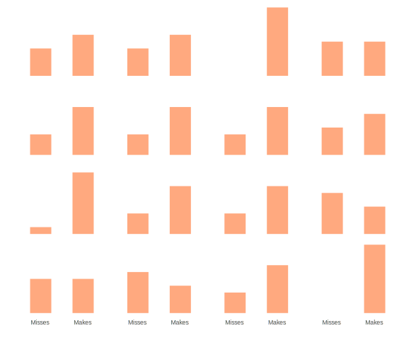
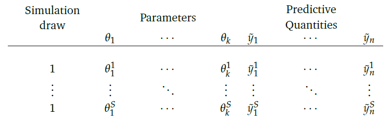

# A Hands-on Example

## Prior, likelihood, & posterior distributions

The following is an attempt to provide a small example to show the connection between prior distribution, likelihood and posterior distribution.  Let's say we want to estimate the probability that a soccer/football player[^football] will score a penalty kick in a shootout.  We will employ the binomial distribution to model this.

Our goal is to estimate a parameter $\theta$, the probability that the random knucklehead from your favorite football team will score the penalty in an overtime shootout.  Let's say that for this match it takes 10 shots per team before the game is decided[^rooney].

In R, we can represent the following data for your team as follows, as well as set up some other things for later.

```{r goaldat}
shots = c('goal','goal','goal','miss','miss',
          'goal','goal','miss','miss','goal')

# convert to numeric, arbitrarily picking goal=1, miss=0
shotsNum = as.numeric(shots=='goal')
N = length(shots)                      # sample size
nGoal = sum(shots=='goal')             # number of shots made
nMiss = sum(shots=='miss')             # number of those miss
```


Recall the binomial distribution where we specify the number of trials for a particular observation and the probability of an event. Let's look at the distribution for a couple values for $\theta$ equal to .5 and .85, and $N=10$ observations.  We will repeat this 1000 times.

```{r binomdist, fig.show='hide', echo=-1}
set.seed(1234)
x1 = rbinom(1000, size=10, p=.5)
x2 = rbinom(1000, size=10, p=.85)

mean(x1); hist(x1)
mean(x2); hist(x2)
```

```{r binomdist_hist, eval=FALSE, echo=FALSE}
# if desired
qplot(x1) + geom_bar(fill=palettes$orange$orange, color=palettes$orange$complementary[2]) + theme_trueMinimal()
qplot(x2) + geom_bar(fill=palettes$orange$orange, color=palettes$orange$complementary[2]) + theme_trueMinimal()
```


The histograms are not shown, but we can see the means are roughly around $N*p$ as we expect with the binomial. 


## Prior

For our current situation, we don't know $\theta$ and are trying to estimate it.  We will start by supplying some possible values. To keep things simple, we'll only consider 10 values that fall between 0 and 1. 

```{r binomGoalStart }
theta = seq(from=1/(N+1), to=N/(N+1), length=10)
```

For the Bayesian approach we must choose a <span class="emph">prior distribution</span> representing our initial beliefs about the estimates we might potentially consider.  I provide three possibilities, and note that any one of them would work just fine for this situation. We'll go with a triangular distribution, which will put most of the weight toward values around $.5$. While we will talk more about this later, I will go ahead and mention that this is where some specifically have taken issue with Bayesian estimation in the past, because this part of the process is too *subjective* for their tastes.  Setting aside the fact that subjectivity is an inherent part of the scientific process, and that ignoring prior information (if explicitly available from prior research) would be blatantly unscientific, the main point to make here is that this choice *is not an arbitrary one*.  There are many distributions we might work with, but some will be better for us than others.  Again, we'll revisit this topic later. While we will only work with one prior, I provide others you can play with[^chooseprior]. 

```{r binomGoalPrior}
### prior distribution
# triangular as in Kruschke text example
pTheta = pmin(theta, 1-theta)

# uniform
# pTheta = dunif(theta)

# beta prior with mean = .5
# pTheta = dbeta(theta, 10, 10)

# Normalize so that values sum to 1
pTheta = pTheta/sum(pTheta) 
```

So, given some estimate of $\theta$, we have a probability of that value based on our chosen prior.


## Likelihood

Next we will compute the <span class="emph">likelihood</span> of the data given some value of $\theta$.  Generally, the likelihood for some target variable $y$, with observed values $i \dots n$, given some (set of) parameter(s) $\theta$, can be expressed as follows:


$$p(y|\theta) = \prod_{i}^{n} p(y_i|\theta)$$


Specifically, the likelihood function for the binomial can be expressed as:


$$p(y|\theta) = {N \choose k}\, \theta^k\,  (1-\theta)^{N-k}$$


where $N$ is the total number of possible times in which the event  of interest could occur, and $k$ number of times the event of interest occurs. Our maximum likelihood estimate in this simple setting would simply be the proportion of events witnessed out of the total number of samples[^binomll]. We'll use the formula presented above.  Technically, the first term is not required, but it serves to normalize the likelihood as we did with the prior[^addcovariates].  

```{r binomGoallikelihood, echo=2}
# use the formula
pDataGivenTheta = choose(N, nGoal) * theta^nGoal * (1-theta)^nMiss


# Alternative methods
# # get the liklihood for each value given each theta
# pDataGivenTheta2 = dbinom(6, size=10, prob=theta)
# pDataGivenTheta3 = sapply(theta, function(p) dbinom(driveNum, size=1, prob=p))
# # 
# # # columns represent a given theta estimate, rows the likelihood for each observation
# # head(pDataGivenTheta0, 3)
# # 
# # # get the products of the columns
# pDataGivenTheta3 = apply(pDataGivenTheta3, 2, prod) 
# pDataGivenTheta3 = pDataGivenTheta/sum(pDataGivenTheta) #normalize as with the prior
```


## Posterior

Given the prior and likelihood, we can now compute the <span class="emph">posterior distribution</span> via Bayes theorem. The only thing left to calculate is the denominator from Bayes theorem, then plug in the rest.

```{r binomGoalPosterior}
pData = sum(pDataGivenTheta*pTheta)  # marginal probability of the data

pThetaGivenData = pDataGivenTheta*pTheta / pData  # Bayes theorem
```

Now let's examine what all we've got.

```{r binomGoalResult, echo=F}
out = data.frame(theta, prior=pTheta, likelihood=pDataGivenTheta, posterior=pThetaGivenData)

out %>% 
  kable(align = 'cccc', digits = 3) %>% 
  kable_styling(full_width = F) %>% 
  column_spec(column=1:ncol(out), width='100px', monospace = T,extra_css = 'font-size: 90%')
```

Starting with the *prior* column, we can see that with the triangular distribution, we've given most of our prior probability to the middle values with probability tapering off somewhat slowly towards either extreme.  The likelihood, on the other hand, suggests the data is most likely for $\theta$ values .55-.64, though we know the specific maximum likelihood estimate for $\theta$ is the proportion for the sample, or .6.  Our posterior estimate will therefore fall somewhere between the prior and likelihood estimates, and we can see it has shifted the bulk of the probability slightly away from the most likely values suggested by the prior distribution, and towards a $\theta$ value suggested by the data of .6.

Let's go ahead and see what the mean[^expectedvalue] is: 


```{r binomPosteriorMean}
posteriorMean = sum(pThetaGivenData*theta)
posteriorMean
```

So, we start with a prior centered on a value of $\theta=.5$, add data whose ML estimate is $\theta=.6$, and our posterior distribution suggests we end up somewhere in between.

We can perhaps understand this further via the following visualizations. In each of these the prior is represented by the blue density, the likelihood by the red, and the posterior by purple.  This first is based on a different prior than just used in our example, and instead employs the beta distribution noted among the possibilities in the [code above][Prior].  The beta distribution is highly flexible, and with shape parameters $\mathcal{A}$ and $\mathcal{B}$ set to 10 and 10 we get a symmetric distribution centered on $\theta = .5$.  This would actually be a somewhat stronger prior than we might normally want to use, but serves to illustrate a point.  The mean of the beta is $\frac{\mathcal{A}}{\mathcal{A}+\mathcal{B}}$, and thus has a nice interpretation as a prior based on data with sample size equal to $\mathcal{A}+\mathcal{B}$.  The posterior distribution that results would have a mean somewhere between the maximum likelihood value and that of the prior. With the stronger prior, the posterior is pulled closer to it.


```{r prior2post_1, echo=F}
set.seed(1234)
nGoal = 6       # number of scores
nMiss = 4           # number not
theta = seq(from=.00001, to = .9999, length=5000)
pTheta = dbeta(theta, 10, 10)
pTheta = pTheta/sum(pTheta) # Normalize so sum to 1
pDataGivenTheta =  theta^nGoal * (1-theta)^nMiss
pDataGivenTheta = pDataGivenTheta/sum(pDataGivenTheta)
pData = sum(pDataGivenTheta*pTheta)
pThetaGivenData = pDataGivenTheta*pTheta  / pData

probdat = data.frame(prior=pTheta, likelihood=pDataGivenTheta, posterior=pThetaGivenData)

# use ggplot or plotly depending on what works
g = ggplot(aes(x=theta), data=probdat, xlim=c(0,1)) +
  geom_polygon(aes(y=prior), fill=palettes$Rblue$Rblue, alpha=.25) +
  # annotate('text',x=.2, y=3e-4, label='Prior&nbsp;with&nbsp;beta(10, 10)', color=alpha(palettes$Rblue$Rblue, .75), parse=T) + # doesn't work with ggplot (use~); but does with plotly
  annotate('text',x=.2, y=3e-4, label='Prior~with~beta(10, 10)', color=alpha(palettes$Rblue$Rblue, .75), parse=T) + # doesn't work with ggplot (use~); but does with plotly
  geom_polygon(aes(y=likelihood), fill='red', alpha=.25) +
  annotate('text', x=.8, y=4e-4, label='Likelihood', color=palettes$stan_red$stan_red) +
  geom_polygon(aes(y=posterior), fill=palettes$tyrian_purple$tyrian_purple, alpha=.25) +
  annotate('text', x=.4, y=8e-4, label='Posterior', color=palettes$tyrian_purple$tyrian_purple) +
  ylim(c(0, .001)) +
  ylab('Density') +
  xlab(substitute('theta')) +
  theme_trueMinimal() +
  theme(axis.ticks.y=element_blank(),
        axis.text.y=element_blank(),
        axis.title.y=element_text(color='gray35'),
        axis.title.x=element_text(color='gray35'),
        plot.background = element_rect(fill = "transparent",colour = NA),
        panel.background=element_rect(fill = "transparent",colour = NA))
g
# plotly::ggplotly(width='50%')
# PLOTLY CURRENTLY BREAKS MATHJAX FOR TUFTE, FANTASTIC!
# library(plotly)
# ggplotly(tooltip='none') %>%
#   config(displayModeBar=F) %>%
#   layout(paper_bgcolor=rgb(0,0,0,0), plot_bgcolor=rgb(0,0,0,0))
```


The second utilizes a more diffuse prior of $\beta(2,2)$[^betadist].  The result of using the vague prior is that the likelihood gets more weight with regard to the posterior.  In fact, if we used a uniform distribution, *we would essentially be doing the equivalent of maximum likelihood estimation*.  In that sense, many of the commonly used methods that implement maximum likelihood can be seen as a special case of a Bayesian approach.

```{r prior2post_2, echo=FALSE}
### more vague prior
set.seed(1234)
nGoal = 6       # number of scores
nMiss = 4           # number not
pTheta = dbeta(theta, 2, 2)
pTheta = pTheta/sum(pTheta) # Normalize so sum to 1
pDataGivenTheta = theta^nGoal * (1-theta)^nMiss
pDataGivenTheta = pDataGivenTheta/sum(pDataGivenTheta)
pData = sum(pDataGivenTheta*pTheta)
pThetaGivenData = pDataGivenTheta*pTheta  / pData

probdat = data.frame(prior=pTheta, likelihood=pDataGivenTheta, posterior=pThetaGivenData)


g = ggplot(aes(x=theta), data=probdat, xlim=c(0,1)) +
  geom_polygon(aes(y=prior), fill=palettes$Rblue$Rblue, alpha=.25) +
  # annotate('text',x=.25, y=3e-4, label='Prior&nbsp;with&nbsp;beta(2, 2)', color=palettes$Rblue$Rblue, parse=T) +
  annotate('text',x=.25, y=3e-4, label='Prior~with~beta(2, 2)', color=palettes$Rblue$Rblue, parse=T) +
  geom_polygon(aes(y=likelihood), fill='red', alpha=.25) +
  annotate('text', x=.8, y=5e-4, label='Likelihood', color=palettes$stan_red$stan_red) +
  geom_polygon(aes(y=posterior), fill=palettes$tyrian_purple$tyrian_purple, alpha=.25) +
  annotate('text', x=.4, y=5e-4, label='Posterior', color=palettes$tyrian_purple$tyrian_purple) +
  ylim(c(0, .001)) +
  ylab('Density') +
  xlab(expression('theta')) +
  theme_trueMinimal() +
  theme(axis.ticks.y=element_blank(),
        axis.text.y=element_blank(),
        axis.title.y=element_text(color='gray35'),
        axis.title.x=element_text(color='gray35'),
        plot.background = element_rect(fill = "transparent",colour = NA),
        panel.background=element_rect(fill = "transparent",colour = NA))
g
# ggplotly()
```


The third graph employs the initial $\beta(10,10)$ prior again, but this time we add more observations to the data.  This serves to give more weight to the likelihood, which is what we want.  As scientists, we'd want the evidence, i.e. data, to eventually outweigh our prior beliefs about the state of things the more we have of it. 


```{r  prior2post_3, echo=FALSE}
### more data
set.seed(1234)
N = 50
drive = rbinom(N, size=1, p=.6)
nGoal = sum(drive==1)       # number of scores
nMiss = sum(drive==0)           # number not


pTheta = dbeta(theta, 10, 10)
pTheta = pTheta/sum(pTheta) # Normalize so sum to 1
pDataGivenTheta = theta^nGoal * (1-theta)^nMiss
pDataGivenTheta = pDataGivenTheta/sum(pDataGivenTheta)
pData = sum(pDataGivenTheta*pTheta)
pThetaGivenData = pDataGivenTheta*pTheta  / pData

probdat = data.frame(prior=pTheta, likelihood=pDataGivenTheta, posterior=pThetaGivenData)

g = ggplot(aes(x=theta), data=probdat, xlim=c(0,1)) +
  geom_polygon(aes(y=prior), fill=palettes$Rblue$Rblue, alpha=.25) +
  # annotate('text',x=.25, y=6e-4, label='Prior&nbsp;with&nbsp;beta(10, 10)', color=palettes$Rblue$Rblue, parse=T) +
  annotate('text',x=.25, y=6e-4, label='Prior~with~beta(10, 10)', color=palettes$Rblue$Rblue, parse=T) +
  geom_polygon(aes(y=likelihood), fill='red', alpha=.25) +
  annotate('text', x=.8, y=1e-3, label=paste('Likelihood with N =', N), color=palettes$stan_red$stan_red) +
  geom_polygon(aes(y=posterior), fill=palettes$tyrian_purple$tyrian_purple, alpha=.25) +
  annotate('text', x=.45, y=1e-3, label='Posterior', color=palettes$tyrian_purple$tyrian_purple) +
  ylim(c(0, .0014)) +
  ylab('Density') +
  xlab('theta') +
  theme_trueMinimal() +
  theme(axis.ticks.y=element_blank(),
        axis.text.y=element_blank(),
        axis.title.y=element_text(color='gray35'),
        axis.title.x=element_text(color='gray35'),
        plot.background = element_rect(fill = "transparent",colour = NA),
        panel.background=element_rect(fill = "transparent",colour = NA))
g

# ggplotly()
```

For an interactive demonstration of the above, [see this](https://micl.shinyapps.io/prior2post/).


## Posterior predictive

At this point it is hoped you have a better understanding of the process of Bayesian estimation.  Conceptually, one starts with prior beliefs about the state of the world and adds evidence to one's understanding, ultimately coming to a conclusion that serves as a combination of evidence and prior belief.  More concretely, we have a prior distribution regarding parameters, a distribution regarding the data given those parameters, and finally a posterior distribution that is the weighted combination of the two.

However, there is yet another distribution of interest to us- the <span class="emph">posterior predictive distribution</span>.  Stated simply, once we have the posterior distribution for $\theta$, we can then feed (possibly new or unobserved) data into the data generating process and get distributions for $\tilde{y}$[^postpred]. Where $\tilde{y}$ can regard *any* potential observation, we can distinguish it from the case where we use the current data to produce $y^{\textrm{Rep}}$, i.e. a replicate of $y$. For example, if a regression model had predictor variables $X$, the predictor variables are identical for producing $y^{\textrm{Rep}}$ as they were in modeling $y$.  However, $\tilde{y}$ might be based on any values $\tilde{X}$ that might be feasible or interesting, whether actually observed in the data or not.  Since $y^{\textrm{Rep}}$ is an attempt to replicate the observed data based on the parameters $\theta$, we can compare our simulated data to the observed data to see how well they match. 

We can implement the simulation process with the data and model at hand, given a sample of values of $\theta$ drawn from the posterior. I provide the results of such a process with the following graph. Each bar graph of frequencies represents a replication of the 10 shots taken, i.e. $y^{\textrm{Rep}}$, given an estimate of $\theta$ from the posterior distribution (16 total).  These are plausible sets of 10 makes and misses, given $\theta$.

</span>

```{r binomPostPred, eval=FALSE, echo=FALSE}
## Do keep  so you don't have to run rstanarm
library(rstanarm)
shotres = stan_glm(shotsNum~1, family='binomial', iter=2250, warmup=1000, thin=10, prior=student_t())
yrep = data.frame(posterior_predict(shotres)); colnames(yrep) = paste0('Player_', 1:10)

sampleIndex = sample(1:500, 16)
yrepLong = tidyr::gather(data.frame(Sim=1:500, yrep)[sampleIndex, ], key=Player, value=Goal, -Sim) %>% 
  arrange(Sim)


ggplot(aes(x=factor(Goal, labels=c('Misses', 'Makes'))), data=yrepLong) +
  geom_bar(fill='#ff5500', color=NA, alpha=.5, width=.5) +
  facet_wrap(~Sim, ncol=4) +
  labs(x='', y='') +
  theme_minimal() + 
  theme(panel.grid = element_blank(),
    # axis.text.x = element_blank(),
    axis.text.y = element_blank(),
    # axis.ticks.x = element_blank(),
    axis.ticks.y = element_blank(),
    strip.text = element_blank(),
    plot.background = element_rect(fill = "transparent",colour = NA))
ggsave('img/histofyrepBinom.svg', bg='transparent')
```


<br>

With an understanding of the key elements of Bayesian inference in hand, we can proceed to the still familiar but more complex and interesting setting of a regression model.

<!-- 
%%%%%%%%%%%%%%%%%%%%%%%%%%%%%%%%%%%%%%%%%%%%%%%%%%%%%%%%%%%%%%%%%%%%%%%%%%%%%%%%
% Prior likelihood posterior triplots for posterity
 -->
```{r binomDriveDistplot, eval=FALSE, echo=FALSE}
set.seed(1234)
nGoal = 6       # number of scores
nMiss = 4           # number not
theta = seq(from=.00001, to = .9999, length=5000)
# pTheta = pmin(theta, 1-theta)
# pTheta = dunif(theta)
pTheta = dbeta(theta, 10, 10)
pTheta = pTheta/sum(pTheta) # Normalize so sum to 1
pDataGivenTheta =  theta^nGoal * (1-theta)^nMiss
pDataGivenTheta = pDataGivenTheta/sum(pDataGivenTheta)
pData = sum(pDataGivenTheta*pTheta)
pThetaGivenData = pDataGivenTheta*pTheta  / pData

probdat = data.frame(prior=pTheta, likelihood=pDataGivenTheta, posterior=pThetaGivenData)

ggplot(aes(x=theta), data=probdat, xlim=c(0,1)) +
  geom_polygon(aes(y=prior), fill=palettes$stan_red$tetradic[2], alpha=.25) +
  annotate('text',x=.2, y=3e-4, label='Prior&nbsp;with&nbsp;beta(10, 10)', color=palettes$Rblue$Rblue, parse=T) + # doesn't work with ggplot (use~); but does with plotly
  geom_polygon(aes(y=likelihood), fill='red', alpha=.25) +
  geom_text(x=.8, y=4e-4, label='Likelihood', color=palettes$stan_red$stan_red) +
  geom_polygon(aes(y=posterior), fill='purple', alpha=.25) +
  geom_text(x=.4, y=8e-4, label='Posterior', color=palettes$tyrian_purple$tyrian_purple) +
  ylab('Density') +
#   annotate('title', label='Prior~with~beta(10, 10)', parse=T) +
#   labs(title = expression("Prior~with~ beta(10, 10)"))
  theme_trueMinimal() +
  theme(axis.ticks.y=element_line(color='white'),
        axis.text.y=element_text(color='white'),
        plot.background = element_rect(fill = "transparent",colour = NA))
# ggsave('figure/priorlikepost1.svg', width=3, height=3)
ggsave('img/priorlikepost1_test.png', width=8, height=8, bg = "transparent") # png for faster loading

### more vague prior
set.seed(1234)
nGoal = 6       # number of scores
nMiss = 4           # number not
pTheta = dbeta(theta, 2, 2)
pTheta = pTheta/sum(pTheta) # Normalize so sum to 1
pDataGivenTheta = theta^nGoal * (1-theta)^nMiss
pDataGivenTheta = pDataGivenTheta/sum(pDataGivenTheta)
pData = sum(pDataGivenTheta*pTheta)
pThetaGivenData = pDataGivenTheta*pTheta  / pData

probdat = data.frame(prior=pTheta, likelihood=pDataGivenTheta, posterior=pThetaGivenData)


ggplot(aes(x=theta), data=probdat, xlim=c(0,1)) +
  geom_polygon(aes(y=prior), fill=palettes$Rblue$Rblue, alpha=.25) +
  annotate('text',x=.3, y=3e-4, label='Prior~with~beta(2, 2)', color=palettes$Rblue$Rblue, parse=T) +
  geom_polygon(aes(y=likelihood), fill='red', alpha=.25) +
  geom_text(x=.8, y=5e-4, label='Likelihood', color=palettes$stan_red$stan_red) +
  geom_polygon(aes(y=posterior), fill=palettes$tyrian_purple$tyrian_purple, alpha=.25) +
  geom_text(x=.4, y=5e-4, label='Posterior', color=palettes$tyrian_purple$tyrian_purple) +
  ylab('Density') +
#   annotate('title', label='Prior~with~beta(10, 10)', parse=T) +
#   labs(title = 'A more vague prior') +
  theme_trueMinimal() +
  theme(axis.ticks.y=element_line(color='white'),
        axis.text.y=element_text(color='white'),
        plot.background = element_rect(fill = "transparent",colour = NA))
# ggsave('figure/priorlikepost2.svg', width=3, height=3)
ggsave('figure/priorlikepost2.png', width=8, height=8, bg = "transparent") # png for faster loading

### more data
set.seed(1234)
N = 50
drive = rbinom(N, size=1, p=.6)
nGoal = sum(drive==1)       # number of scores
nMiss = sum(drive==0)           # number not


pTheta = dbeta(theta, 10, 10)
pTheta = pTheta/sum(pTheta) # Normalize so sum to 1
pDataGivenTheta = theta^nGoal * (1-theta)^nMiss
pDataGivenTheta = pDataGivenTheta/sum(pDataGivenTheta)
pData = sum(pDataGivenTheta*pTheta)
pThetaGivenData = pDataGivenTheta*pTheta  / pData

probdat = data.frame(prior=pTheta, likelihood=pDataGivenTheta, posterior=pThetaGivenData)


ggplot(aes(x=theta), data=probdat, xlim=c(0,1)) +
  geom_polygon(aes(y=prior), fill=palettes$Rblue$Rblue, alpha=.25) +
  annotate('text',x=.3, y=6e-4, label='Prior~with~beta(10, 10)', color=palettes$Rblue$Rblue, parse=T) +
  geom_polygon(aes(y=likelihood), fill='red', alpha=.25) +
  geom_text(x=.8, y=1e-3, label=paste('Likelihood with N =', N), color=palettes$stan_red$stan_red) +
  geom_polygon(aes(y=posterior), fill=palettes$tyrian_purple$tyrian_purple, alpha=.25) +
  geom_text(x=.45, y=1e-3, label='Posterior', color=palettes$tyrian_purple$tyrian_purple) +
  ylab('Density') +
#   annotate('title', label='Prior~with~beta(10, 10)', parse=T) +
#   labs(title = expression("Prior~with~ beta(10, 10)"))
  theme_trueMinimal() +
  theme(axis.ticks.y=element_line(color='white'),
        axis.text.y=element_text(color='white'),
        plot.background = element_rect(fill = "transparent",colour = NA))
# ggsave('figure/priorlikepost3.svg', width=3, height=3)
ggsave('figure/priorlikepost3.png', width=8, height=8, bg = "transparent") # png for faster loading

```


[^football]: Don't even start, it's always been both 'football' and 'soccer'.

[^rooney]: The fifth shot would have won the game but was taken by Wayne Rooney.

[^binomll]: See for yourself in the [binmoial likelihood][Binomial Likelihood Example] section in the appendix.

[^postpred]: Mathematically represented as: $p(\tilde{y}|y) = \int p(\tilde{y}|\theta)p(\theta|y)\mathrm{d}\theta$ <br><br> We can get a sense of the structure of this process via the following table, taken from Gelman: <br><br> 

[^chooseprior]: Choose the prior that makes most sense to you.  If I were thinking logically, I might choose a prior that reflects that all advantage is to a person that spends their entire life kicking a ball, rather than the person who is required by the rules to stand still.  If the penalty taker can simply kick to the upper right or left of the goal, even with only moderate pace, they could point it out like Babe Ruth every time, and simple physics, i.e. that the goalie can never reach the ball given that he has to start in the middle, would mean they score 95% of the time under perfect conditions. We might revise it downward to account for unspecified things, e.g. how tired they are, weather etc. A prior based on a beta distribution `beta(9,1)`, with a mean of .90, would perhaps be about right.  Of course, the *data* would eventually suggest something much lower, perhaps because soccer players aren't that bright and don't listen to their team statistician, or perhaps the games are rigged, but it's chalked up to drama and mind games because that's what the fans want to believe (and, more importantly, will pay for).  I'll let you decide that binomial outcome.

[^addcovariates]: Note that if we had covariates as in a regression model, we would have different estimates of theta for each observation, and thus would calculate each observation's likelihood and then take their product or sum their log values, see the [Maximum Likelihhood Review][Maximum Likelihood Review] for further details). Even here, if you turn this into binary logistic regression with 10 outcomes of goal scored vs. not, the 'intercept only' model would be identical to our results here.

[^expectedvalue]: The expected value for a continuous parameter is $\operatorname{E}[X] = \int_{-\infty}^\infty xp(x)\mathrm{d}x$, and for a discrete parameter $\operatorname{E}[X] = \sum_{i=1}^\infty x_i\, p_i$, i.e. a weighted sum of the possible values times their respective probability of occurrence.

[^betadist]: $\beta(1,1)$ is a uniform distribution.